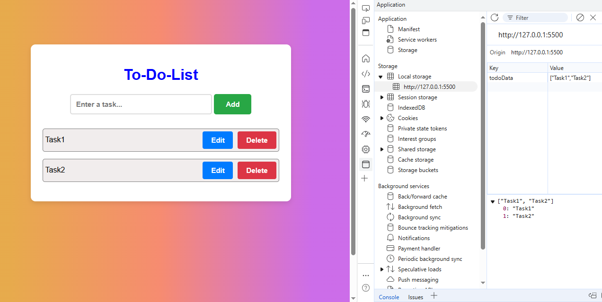
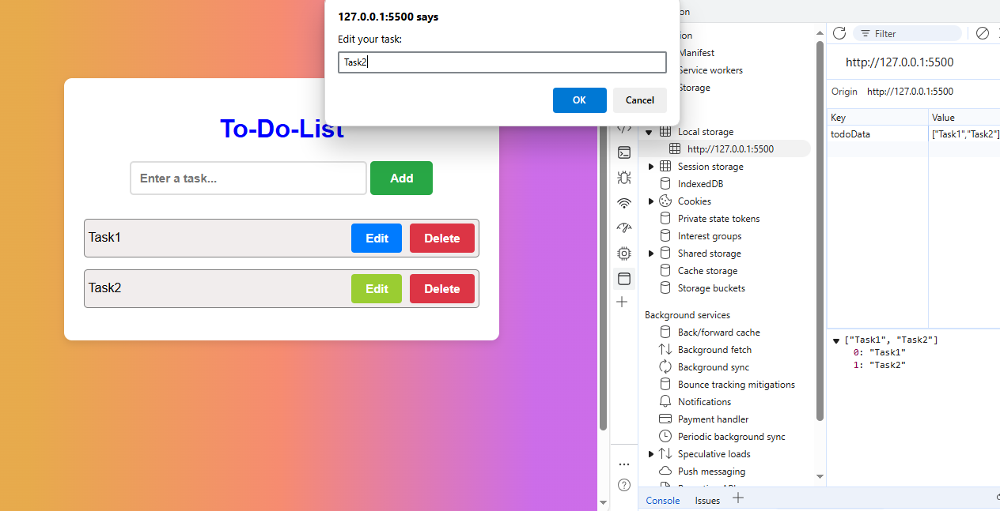
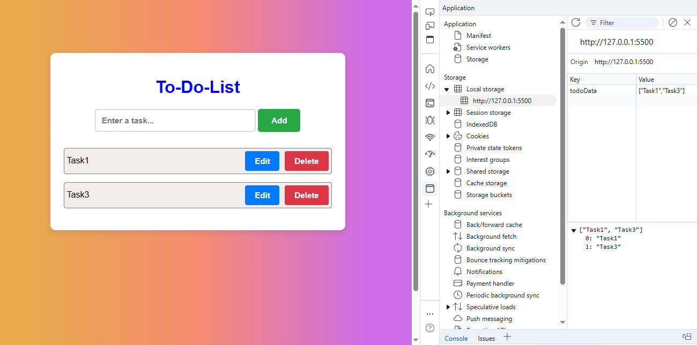

# TodoList-App

The Local Storage-based To-Do List Application is a simple yet effective web tool that allows users to add, update, and delete text items. The application ensures data persistence by saving the items in the browser's local storage, allowing users to access their to-do list even after refreshing or reopening the page. This project focuses on user-friendly functionality and a clean interface to manage to-do items effectively.

## Key Features

### General Functionality
- **Add Items**: Users can input text in a field and click the "Add" button to save the item. The item is added to the list displayed on the page and stored in local storage.
- **Display Items**: All saved items are loaded and displayed automatically when the page is refreshed or reopened.
- **Update Items**: Users can edit any item in the list by clicking the "Edit" button. Changes are updated in real-time and saved in local storage.
- **Delete Items**: Users can remove any item from the list by clicking the "Delete" button. The item is removed from both the page and local storage.

### Local Storage Handling
- Uses localStorage to ensure that all operations (add, update, delete) persist data across browser sessions.
- Automatically reloads the to-do list from local storage upon page refresh.

### User Interface (UI)
- Simple and intuitive design with a clean layout.
- Clear visibility of the input field, add button, list of items, and edit/delete options.
- Styled using basic CSS for margins, padding, font sizes, and colors to enhance usability.

## Screenshots

### Screenshot-01

### Screenshot-02

### Screenshot-03

### Screenshot-04

## Technologies Used

### Frontend Technology
- **HTML**: Provides the structure for the to-do list application.
- **CSS**: Adds basic styling for layout, fonts, colors, and buttons.
- **JavaScript**: Implements the core functionality (add, update, delete, and display items) and handles local storage operations.

### Local Storage
- Uses localStorage.setItem() to save items.
- Uses localStorage.getItem() to retrieve and display items.
- Uses localStorage.removeItem() to delete specific items from storage.
- The to-do list updates the local storage after every operation.

